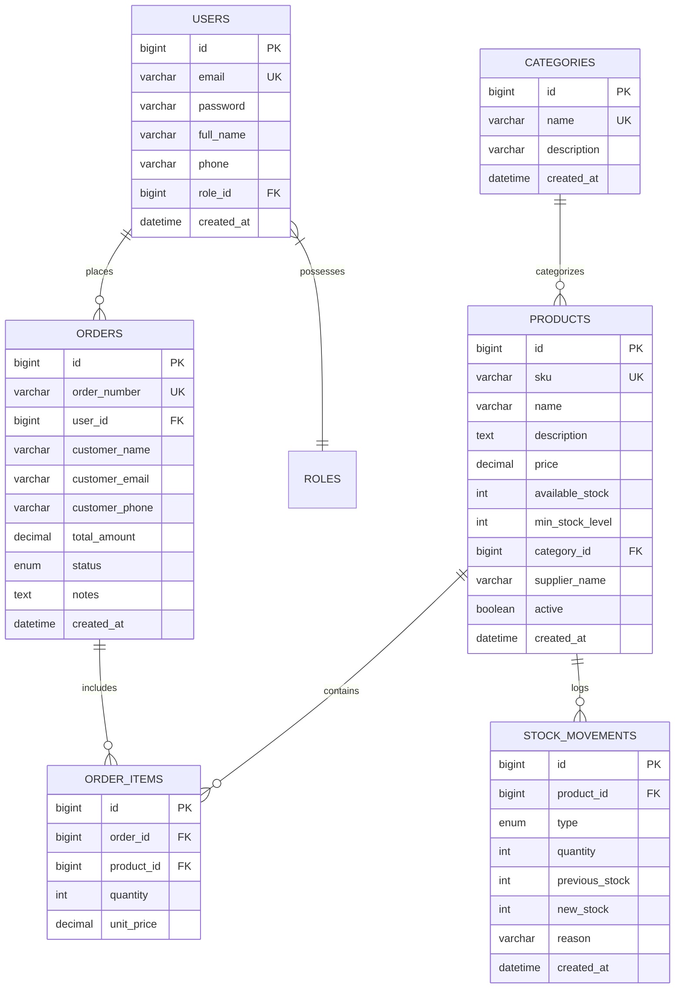

# 🛒 SB Marts - Full-Stack Supermarket & Inventory Management System
## System Architecture, Database Design, API Specifications, & Cloud Deployment Documentation

---

## 📌 Executive Summary

**SB Marts** is a state-of-the-art, full-stack enterprise supermarket e-commerce and inventory management platform. Built using **Java 17 Spring Boot 3.2.5**, **Spring Data JPA**, **Spring Security (JWT)**, **MySQL 8.0**, and a custom-crafted **Responsive Vanilla JavaScript/CSS Frontend**, SB Marts seamlessly bridges customer grocery shopping with real-time operations management for supermarket administrators.

---

## 🏗️ System Architecture & Technology Stack

```
                               ┌──────────────────────────────────────────────┐
                               │             USER / CLIENT LAYER              │
                               │                                              │
                               │  🛍️ Customer Storefront    ⚙️ Admin Control │
                               │     (index.html)              (admin.html)   │
                               └──────────────────────┬───────────────────────┘
                                                      │
                                                      │ HTTPS / JSON REST API
                                                      ▼
                               ┌──────────────────────────────────────────────┐
                               │           SPRING BOOT BACKEND API            │
                               │                                              │
                               │  • AuthController     • ProductController    │
                               │  • OrderController    • StockController      │
                               │  • CategoryController • DashboardController  │
                               │  • JwtAuthenticationFilter & SecurityConfig │
                               └──────────────────────┬───────────────────────┘
                                                      │
                                                      │ Hibernate ORM / JDBC
                                                      ▼
                               ┌──────────────────────────────────────────────┐
                               │          DATABASE PERSISTENCE LAYER          │
                               │                                              │
                               │           🐬 MySQL 8.0 Database              │
                               │            (supermarket_db)                  │
                               └──────────────────────────────────────────────┘
```

### 1. Key Technologies Used
- **Backend Framework**: Java 17, Spring Boot 3.2.5
- **Security & Authentication**: Spring Security, JWT (JSON Web Tokens), BCrypt Password Hashing
- **Persistence & ORM**: Spring Data JPA, Hibernate, MySQL 8.0 Connector
- **Frontend Architecture**: HTML5, Vanilla JavaScript (ES6+), Vanilla CSS3 Design System, Font Awesome 6
- **Build & Package Tooling**: Apache Maven 3.9.6, Docker (`maven:3.9.6-eclipse-temurin-17-alpine`)
- **Cloud Infrastructure**: Railway.app (Cloud MySQL + Docker App Service Container)

---

## 🗄️ Database Design & Schema Structure (`supermarket_db`)

The database consists of 7 normalized relational tables enforcing referential integrity, foreign key constraints, and automatic auditing timestamps (`created_at`, `updated_at`).



---

## 🔌 REST API Specification Endpoints

All API endpoints are prefixed under `/api/v1`.

### 1. Authentication & Users (`/api/v1/auth`)
- `POST /api/v1/auth/register` — Create a new customer account
- `POST /api/v1/auth/login` — Authenticate user credentials and return JWT bearer token

### 2. Grocery Catalog & Products (`/api/v1/products`)
- `GET /api/v1/products?size=100` — Retrieve list of active grocery products
- `GET /api/v1/products/{id}` — Fetch detailed product information by ID
- `POST /api/v1/products` — Create a new grocery product (Admin)

### 3. Categories Management (`/api/v1/categories`)
- `GET /api/v1/categories` — Retrieve all supermarket product categories
- `POST /api/v1/categories` — Create a new product category (Admin)

### 4. Orders & Checkout (`/api/v1/orders`)
- `POST /api/v1/orders` — Submit a new customer order with stock deduction
- `GET /api/v1/orders?size=100` — Retrieve orders list (Filtered per customer account on Storefront; Full list on Admin Control Panel)
- `PATCH /api/v1/orders/{id}/status` — Update order status (`PENDING` → `CONFIRMED` → `SHIPPED` → `DELIVERED` | `CANCELLED`)

### 5. Stock & Inventory Audit (`/api/v1/stock`)
- `POST /api/v1/stock/stock-in` — Perform Stock-In addition with audit record
- `POST /api/v1/stock/stock-out` — Perform Stock-Out deduction with negative balance prevention
- `GET /api/v1/stock/low-stock` — Retrieve items where `available_stock <= min_stock_level`

### 6. Analytics & Dashboard (`/api/v1/dashboard`)
- `GET /api/v1/dashboard/summary` — Executive metrics (Revenue, Total Orders, Order Status Breakdown, Low Stock Count)

---

## 💻 Key Features & Workflow Implementations

### 🛍️ Customer Storefront (`index.html` & `user-app.js`)
1. **Default Light Luxury Aesthetic**: Premium clean interface with light mode default and dark mode toggling (`🌙`).
2. **Interactive Top Navbar**: Instant Categories dropdown, Weekly Deals, Wishlist drawer counter, My Orders, and Floating Cart.
3. **Full Product Card Navigation**: Click anywhere on a product card to open the dedicated Product Specification Detail View.
4. **Instant Global Search**: Live search modal filtering products by name, SKU, or category in real-time.
5. **Cart Authentication Requirement Gate**: Prompts Sign In / Sign Up modal if an unauthenticated guest attempts to open the cart.
6. **Real-Time Visual Order Stepper Tracker**: Interactive 4-step progress timeline (`Order Placed` ➔ `Confirmed` ➔ `Out for Delivery` ➔ `Delivered`) updating live every 3 seconds.
7. **Strict Order Privacy**: Customer's "My Orders" tab filters strictly by account email/phone/session, hiding other customers' orders.

### ⚙️ Admin Control Panel (`admin.html` & `admin-app.js`)
1. **Executive Operations Dashboard**: Sales revenue breakdown, total order metrics, and status distribution pills.
2. **Dynamic Restock Warning Alerts**: Automatically calculates and renders items below minimum threshold (`availableStock <= minStockLevel`), dynamically removing items when restocked in MySQL.
3. **Stock-In & Stock-Out Inventory Engine**: Incremental stock additions and deductions directly persisted to MySQL with automated movement logging.
4. **Order Status Lifecycle Manager**: Interactive status dropdown allowing admin staff to transition orders while maintaining exact inventory sync.

---

## ☁️ Production Deployment Guide (Railway.app)

The application is deployed live in a single unified cloud container architecture on **Railway.app**:

- 🌐 **Live Storefront URL**: `https://supermarket-website-production.up.railway.app/index.html`
- ⚙️ **Live Admin Panel URL**: `https://supermarket-website-production.up.railway.app/admin.html`
- 🍃 **Live REST API Endpoint**: `https://supermarket-website-production.up.railway.app/api/v1/products`

### Environment Variables Configuration on Railway:
```env
SPRING_PROFILES_ACTIVE=prod
SPRING_DATASOURCE_URL=jdbc:mysql://${{MySQL.MYSQLHOST}}:${{MySQL.MYSQLPORT}}/${{MySQL.MYSQLDATABASE}}?createDatabaseIfNotExist=true&useSSL=false&allowPublicKeyRetrieval=true
SPRING_DATASOURCE_USERNAME=${{MySQL.MYSQLUSER}}
SPRING_DATASOURCE_PASSWORD=${{MySQL.MYSQLPASSWORD}}
```

---

## 📈 Verification & Testing Checklist

- [x] **MySQL Database Persistence**: Verified `users`, `products`, `orders`, `order_items`, `stock_movements`, and `categories` schema creation and records.
- [x] **Spring Security Permits**: Verified public CORS read/write access for storefront APIs and authentication routes.
- [x] **Dual Order Sync**: Verified real-time background sync between customer order submission and admin panel status management.
- [x] **Order Privacy Verification**: Confirmed individual customer accounts strictly view their own orders under **My Orders**.
- [x] **Dynamic Restock Alerts**: Verified low-stock items appear dynamically and disappear immediately upon performing a Stock-In operation.
